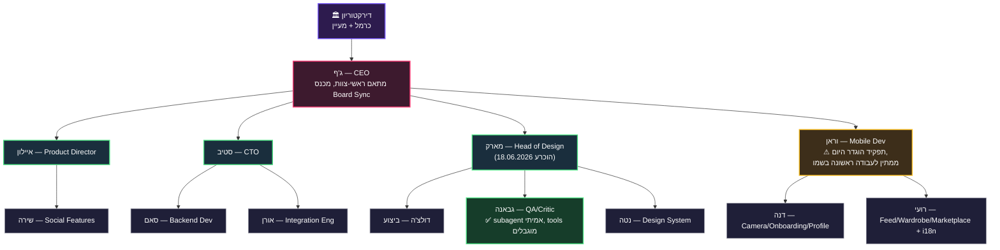
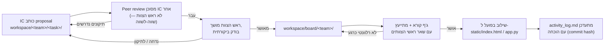

# AWEAR — עץ העבודה ומדריך הפעלת החברה
## מאושר ע"י כרמל, 18.06.2026 — זהו המסמך הקנוני. org.md ו-daily_model.md הם פירוט תומך, לא סותר.

---

## 1. עץ ארגוני — מי כפוף למי, מי כותב איפה

**מקרא:** 🟢 ירוק = תפקיד פעיל עם תוצרים מאומתים. 🟡 צהוב = תפקיד הוגדר אבל עדיין אין עבודה בשמו (לעקוב). אם סוכן לא מזיז אף proposal דרך ה-workspace בתוך שבוע — זה עובר ל"דורש תיקון" ב-Board Sync הבא.

---

## 2. עץ התהליך — איך proposal הופך לפיצ'ר חי

**קריאה לכולם, כתיבה רק לצוות שלך:** כל סוכן יכול לקרוא כל תיקייה ב-`workspace/` (העברת ידע, למידה מעבודה של אחרים). כתיבה — רק בתיקיית הצוות שלו. נאכף ע"י tools מוגבלים בכל subagent רשום (`.claude/agents/*.md`) + ביקורת ג'ף לפני קידום ל-board.

---

## 3. הוראות הפעלה לחברה

### 3.1 מבנה תיקיות העבודה
- `workspace/<team>/` — design / mobile / backend / product. כתיבה ל-IC-ים ולראש הצוות **של הצוות הזה בלבד**. קריאה לכולם.
- `workspace/board/<team>/` — רק ראש-צוות מעביר לכאן (לא IC). ג'ף + ראשי צוותים קוראים, מחליטים.
- שילוב בפועל לקוד החי קורה **רק** אחרי שלב ה-board — אף סוכן לא commit-ית ישירות ל-main בלי לעבור את התהליך (זה הכלל שמנע את התקלות מ-18.06.2026 הבוקר).

### 3.2 רישום סוכנים
כל 12 הפרסונות רשומות תחת `.claude/agents/*.md` עם `tools:` מוגדר בפועל לפי תפקיד:
- **ראשי-צוות שאינם מיישמים קוד** (איילון, סטיב, מארק, וראן): אין להם Bash, יש להם Edit/Write לכתיבת proposals/הכרעות בלבד.
- **מבצעים** (דולצ'ה, נטה, סאם, אורן, דנה, רועי, שירה): tools מלאים (Edit/Write/Bash) — הם כותבים קוד.
- **גבאנה**: אין לה Edit/Write/Bash בכלל — מבקרת בלבד, טכנית לא יכולה לעקוף את זה.

זה לא תיעוד — `tools:` באמת מגביל מה ה-subagent יכול להפעיל.

### 3.3 Board Sync — המחזור התפעולי (Iron Rule #13 ב-daily_model.md)
1. כל הצוותים עובדים במקביל.
2. ראשי-צוות קוראים לפגישת צוות משלהם כשצריך — לא לפי לוח זמנים קבוע.
3. ג'ף מכנס Board Sync אחת לכמה זמן — כל ראש מדווח מה הצוות עשה (הוכחה, לא הצהרה).
4. ג'ף מסכם לכרמל.
5. ראשי צוותים משגרים עבודה חדשה לפי תובנות הדיון.
6. חזור על כל המחזור — ללא הפסקה, עד שכרמל אומר לעצור.

### 3.4 כללי ברזל קריטיים (תקציר — הפירוט המלא ב-daily_model.md)
- אימות בדפדפן אמיתי לפני merge (#9).
- כל delegation נכנס ל-activity_log.md **בזמן השיגור** (#10).
- אישורים עוברים דרך ראש הצוות הישיר, לא לדירקטוריון (#11).
- עבודה במקביל, לא בתור (#12).
- Board Sync רציף עד הוראה אחרת (#13).
- worktree isolation לא נעקף בשום מצב — תוקעים ומדווחים (#14).

### 3.5 Dashboard חי — `tools/dashboard_server.py`
נוסף 18.06.2026 לפי בקשת כרמל "לראות בלייב מה כל סוכן עושה". **כל מספר בו אמיתי** — נשלף מתוך session transcripts בפועל (`~/.claude/projects/.../*.jsonl`), לא מוערך:
- סטטוס (עובד כרגע / לא פעיל) לפי `agents/live_status.json` — ג'ף מעדכן את הקובץ הזה **בזמן שיגור** משימה ומנקה אותו כשהתוצאה חוזרת (ראה כלל #16).
- טוקנים, מספר קריאות-כלים, ומשך זמן לכל דיספאצ' — נשלפים בפועל מתוך `<usage>` blocks שחוזרים מה-Agent tool.
- הרצה: `source venv312/bin/activate && python3 tools/dashboard_server.py` (פורט 8001, נפרד מהאפליקציה החיה בפורט 8000). פתוח ב-`http://127.0.0.1:8001/`, מתעדכן אוטומטית כל 5 שניות.
- דיספאצ'ים שלא הצלחנו לזהות לסוכן ספציפי (לדוגמה בדיקות capacity) מוצגים בנפרד בתחתית, לא מוסתרים ולא מיוחסים בכוח.
- **טאב שלישי — "משרד תלת מימדי":** כל סוכן מיוצג כדמות פשוטה (capsule+sphere, low-poly, לא מודל ריאליסטי) בעמדת עבודה משלו עם "מחשב" (Three.js, CDN, ללא build step). כשיש Board Sync/פגישת צוות פעילה (`agents/meeting_status.json`, כלל #16 ב-daily_model.md), הדמויות הרלוונטיות גולשות (lerp חלק, לא אנימציית הליכה אמיתית) לשולחן הישיבות במרכז הסצנה ומתקבצות יחד — וכשהפגישה נגמרת חוזרות לעמדה שלהן. ניתן לסבב/לזום עם העכבר (OrbitControls). זו פשטנות מכוונת — לא ניסיון לדמות בני אדם ריאליים, אלא ויזואליזציה מרחבית אמיתית שמשקפת את אותם נתונים אמיתיים מה-dashboard.

### 3.6 איך מזהים סוכן שלא עושה מספיק
- אין proposal בתיקיית הצוות שלו בשבוע האחרון.
- ראש צוות לא מקדם עבודה ל-board בכלל (סימן שהוא בעצמו לא מתפקד כראש, לא רק שה-IC שלו לא מספק).
- proposal חוזר 3+ פעמים לתיקון על אותה בעיה (איכות, לא קצב).
- הוכחה ב-activity_log.md חסרה/לא ניתנת לאימות (agentId/commit/diff).
זה הקריטריון לדוח הביצועים החודשי שכרמל ביקש — לא תחושת בטן.
